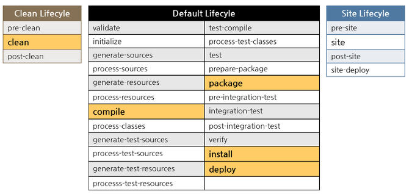

<!-- TOC -->

- [Maven Core Concept](#maven-core-concept)
	- [Standard Dicrectory Layout](#standard-dicrectory-layout)
	- [Dependency](#dependency)
	- [LifeCycle and Phrase](#lifecycle-and-phrase)
	- [Plugin and Goal](#plugin-and-goal)
	- [Properties](#properties)
		- [Maven Project Properties](#maven-project-properties)
		- [Timestamp](#timestamp)
		- [Maven Settings Properties](#maven-settings-properties)
		- [Environment Variable Properties](#environment-variable-properties)
- [Useful Commands](#useful-commands)
- [Maven Plugins](#maven-plugins)
	- [Clean Plugin](#clean-plugin)
	- [Resources Plugin](#resources-plugin)
	- [Compiler Plugin](#compiler-plugin)
	- [Surefire Plugin](#surefire-plugin)
	- [Deploy Plugin](#deploy-plugin)
	- [Maven Dependency Plugin](#maven-dependency-plugin)
	- [Maven Jar Plugin](#maven-jar-plugin)
	- [Assembly Plugin](#assembly-plugin)
	- [Maven Javadoc Plugin](#maven-javadoc-plugin)
	- [Shade Plugin](#shade-plugin)
	- [Formatter maven plugin](#formatter-maven-plugin)
- [More Project Information](#more-project-information)
- [Profile](#profile)
- [Nexus](#nexus)
- [Reference](#reference)
- [Useful links](#useful-links)

<!-- /TOC -->

# Maven Core Concept

Maven is a project management tool base on Project Object Model(POM). 

## Standard Dicrectory Layout
This is the directory layout expected by Maven. Try to confirm with this layout. see [Introduction to the Standard Directory Layout](https://maven.apache.org/guides/introduction/introduction-to-the-standard-directory-layout.html)
* src/main/java	Application/Library sources
* src/main/resources	Application/Library resources
* src/test/java	Test sources
* src/test/resources	Test resources
* src/assembly	Assembly descriptors

##  Dependency

There are 6 scopes
* compile - this is the default.
* provided - expect the JDK or a container to provide the dependency at runtime
* runtime - dependency is not required at compilation
* test
* system
* import

## LifeCycle and Phrase
[Intro to LifeCycle](https://maven.apache.org/guides/introduction/introduction-to-the-lifecycle.html)

There are three build-in build lifecycles
* default lifecycle - build and deploy project
* clean lifecycle - clean up the directory where the the build files are located(usually target folder)
* site lifecycle - create the site




A **lifecycle** is make up of **phrases**.
A Build **Phase** is Made Up of Plugin **Goals**.

**default lifecycle's phases**<br>
* validate - validate the project is correct and all necessary information is available
* process-sources - process the source code
* compile - compile the source code of the project
* process-test-resources - process the test source code
* test-compile - compile the test source code into the test destination directory
* test - test the compiled source code using a suitable unit testing framework. These tests should not require the code be packaged or deployed
* package - take the compiled code and package it in its distributable format, such as a JAR.
* verify - run any checks on results of integration tests to ensure quality criteria are met
* install - install the package into the local repository, for use as a dependency in other projects locally
* deploy - done in the build environment, copies the final package to the remote repository for sharing with other developers and projects.

The complete [Lifecycle Reference](https://maven.apache.org/guides/introduction/introduction-to-the-lifecycle.html#Lifecycle_Reference)

**clean lifecycle's phase**<br>
* pre-clean
* clean
* post-clean

**site lifecycle's phase**<br>
* pre-site
* site
* post-site
* site-deploy

**default lifecycle phase's bindings**<br>
* generate-resources         -->    plugin:descriptor                            
* process-resources          -->    resources:resources                          
* compile                    -->    compiler:compile                             
* process-test-resources     -->    resources:testResources                      
* test-compile               -->    compiler:testCompile                         
* test                       -->    surefire:test                                
* package                    -->    jar:jar and plugin:addPluginArtifactMetadata 
* install                    -->    install:install                              
* deploy                     -->    deploy:deploy                                

Complete list is [Built-in Lifecycle Bindings](https://maven.apache.org/guides/introduction/introduction-to-the-lifecycle.html#Built-in_Lifecycle_Bindings)

## Plugin and Goal
A Build Phase is Made Up of Plugin Goals. A plugin goal represents a specific task. A build phase without any goals will not be executed. 

A plugin contains Goals. Plugins are make up of mojos(Maven plain Old Java Object). Each mojo is an executable goal in Maven

to execute a goal, run command **mvn** follow by pluginName:goalName.

Example: **mvn source:jar**  - bundle all source code in a jar file under Target directory, need to add maven source plugin to pom.xml for this goal to run.

Maven provides some standard plugins, when using the standard plugins, you don't need to provide the groupId *org.apache.maven.plugins* or version. Example **maven-assembly-plugin**
see [Maven Supported Plugins](http://maven.apache.org/plugins/index.html)

to configure a plugin see [Guide to Configuring Plug-ins](https://maven.apache.org/guides/mini/guide-configuring-plugins.html)


## Properties
For more info on Properties see [Maven: The Complete Reference - Maven Properties](https://books.sonatype.com/mvnref-book/reference/resource-filtering-sect-properties.html)

You can use Maven properties in a pom.xml file or in any resource that is being processed by the Maven Resource plugin’s filtering features. A property is always surrounded by ${ and }. e.g ${project.groupId}

Maven project has implicit properties, you can also have user-defined properties.


### Maven Project Properties
use project.* to reference values in a Maven Pom. e.g ${project.groupId}, ${project.version}, ${project.build.sourceDirectory}

* ${project.basedir} - The directory that the current project resides in
* ${project.build.sourceDirectory} - source directory is defined as ${project.basedir}/src/main/java
* ${project.build.directory} - directory is defined as ${project.basedir}/target

see suport POM for the list of pre-defined properties. [pom](https://github.com/apache/maven/blob/trunk/maven-model-builder/src/main/resources/org/apache/maven/model/pom-4.0.0.xml#L53)


### Timestamp
${maven.build.timestamp} is a special variable. It is the timestamp that denotes the start of the build (UTC). Since Maven 2.1.0-M1.

Set the maven build timestamp with format
```xml
<properties>
	<java.version>1.8</java.version>
	<timestamp>${maven.build.timestamp}</timestamp>
	<maven.build.timestamp.format>yyyy-MM-dd HH:mm</maven.build.timestamp.format>
</properties>
```

Timestamp can now be access using 
```
${timestamp}
```

The format pattern has to comply with the rules given in the API documentation for [SimpleDateFormat](https://docs.oracle.com/javase/7/docs/api/java/text/SimpleDateFormat.html).

see [Special Variables](http://maven.apache.org/guides/introduction/introduction-to-the-pom.html#Available_Variables)

### Maven Settings Properties
You can also reference any properties in the Maven Local Settings file which is usually stored in ~/.m2/settings.xml. prefix is settings.*


### Environment Variable Properties
Environment variables can be referenced with the env.* prefix.


# Useful Commands
to generate a maven quick start project
```sh
mvn archetype:generate -DgroupId={project-packaging} -DartifactId={project-name} -DarchetypeArtifactId=maven-archetype-quickstart -DinteractiveMode=false

# example
mvn archetype:generate -DgroupId=com.xinghua24 -DartifactId=HelloProject -DarchetypeArtifactId=maven-archetype-quickstart -DinteractiveMode=false
```

if you call a build phase, it will execute all the phases prior to the called build phase and also the called build phase. 
For Example **mvn install** will execute all phases in defaul lifecycle except deploy phase.

You can not execute a lifecycle directly, you can only execute a phase or a plugin. So when you execute command **mvn clean**, 
the pre-client and clean phase are actually called, not the lifecycle.

format
```
mvn [plugin-name]:[goal-name]
```
execute mvn --help to display help info.<br>
add -X or --debug option to show debug info.<br>
add -U or --update-snapshots to force a check for missing releases and updated snapshots on remote repo<br>


**compile, test, package or install project**<br>
```sh
mvn clean compile

mvn clean test

mvn package

# to skip test
mvn package -DskipTests

# install project in local repo
mvn clean install

# to print debug info, add -X flag
mvn clean test -X

# create eclipse project
mvn eclipse:eclipse

# remove eclipse configuration
mvn eclipse:clean

# create idea project
mvn idea:idea

# show dependency tree
mvn dependency:tree

# show dependency list
mvn dependency:list
```


**generate javadoc**<br>
```text
mvn javadoc:javadoc
```

**get source**<br>
```sh
# download source
mvn dependency:sources

# download javadoc
mvn dependency:resolve -Dclassifier=javadoc
```


# Maven Plugins
## Clean Plugin
[Clean plugin Homepage](https://maven.apache.org/plugins/maven-clean-plugin/)

The Maven Clean Plugin will delete the target directory by default. 

you can also delete additional directories
```xml
<plugin>
	<artifactId>maven-clean-plugin</artifactId>
	<version>3.0.0</version>
	<configuration>
		<filesets>
			<fileset>
				<directory>${basedir}/output-resources</directory>
			</fileset>
		</filesets>
	</configuration>
</plugin>
```


## Resources Plugin
[Resources plugin Homepage](https://maven.apache.org/plugins/maven-resources-plugin/)

The Resources Plugin handles the copying of project resources to the output directory. There are two different kinds of resources:
 main resources and test resources. The difference is that the main resources are the resources associated to the main source code 
 while the test resources are associated to the test source code.


There are 3 goals for this plugin
* resources – copy resources that are part of the main source code to the main output directory
* testResources – copy resources that are part of the test source code to the test output directory
* copy-resources – copy arbitrary resource files to an output directory, requiring us to specify the input files and the output directory


By default only resource in src/main/resources directory is copied to target/classes. additional resources can be added by specifying resource directories.
Same for target/test-classes.
```xml
	<build>
		<resources>
			<resource>
				<directory>src/test/resources</directory>
			</resource>
			<resource>
				<directory>my-resources</directory>
			</resource>
		</resources>
		<testResources>
			<testResource>
				<directory>my-resources</directory>
				<excludes>
					<exclude>**/*.bmp</exclude>
					<exclude>**/*.jpg</exclude>
					<exclude>**/*.jpeg</exclude>
					<exclude>**/*.gif</exclude>
				</excludes>
			</testResource>
		</testResources>
        <!-- other configs -->
	</build>
```

**filtering**<br>
filtering is set to be false by default. if filtering is set to true, variables defined in ${...} format will be replace with property value. 
see [documentation](https://maven.apache.org/plugins/maven-resources-plugin/examples/filter.html)
```xml
		<resources>
			<resource>
				<directory>src/main/java</directory>
				<includes>
					<include>**/*.properties</include>
					<include>**/*.xml</include>
				</includes>
				<filtering>true</filtering>
			</resource>
			<resource>
				<directory>src/main/resources</directory>
				<includes>
					<include>**/**</include>
				</includes>
				<filtering>true</filtering>
			</resource>
		</resources>
```

You can organize the variables and values in a separate properties file. then specify the file in filters element
```xml
   <filters>
      <filter>[a filter property]</filter>
    </filters>
```
This post uses filters: [mkyong profile](http://www.mkyong.com/maven/maven-profiles-example/)


**copy-resources goal**<br>
You can use resources plugin's copy-resources goal to move resource to an arbitrary directory
```xml
<plugin>
	<groupId>org.apache.maven.plugins</groupId>
	<artifactId>maven-resources-plugin</artifactId>
	<version>3.1.0</version>
	<executions>
		<execution>
			<id>copy-resources</id>
			<phase>validate</phase>
			<goals>
				<goal>copy-resources</goal>
			</goals>
			<configuration>
				<outputDirectory>${basedir}/target/special-resources</outputDirectory>
				<resources>
					<resource>
						<directory>my-resources</directory>
						<filtering>true</filtering>
					</resource>
				</resources>
			</configuration>
		</execution>
	</executions>
</plugin>
```


## Compiler Plugin
[Maven Compiler plugin Homepage](https://maven.apache.org/plugins/maven-compiler-plugin/)

two goals
* compiler:compile is bound to the compile phase and is used to compile the main source files.
* compiler:testCompile is bound to the test-compile phase and is used to compile the test source files.

if you want the compiler to use java 8 feature and compile to JVM 1.8, set the source and target parameters.
```xml
  <properties>
    <maven.compiler.source>1.8</maven.compiler.source>
    <maven.compiler.target>1.8</maven.compiler.target>
  </properties>
  
		<plugins>
			<plugin>
				<groupId>org.apache.maven.plugins</groupId>
				<artifactId>maven-compiler-plugin</artifactId>
				<version>3.8.0</version>
				<configuration>
					<source>${java.version}</source>
					<target>${java.version}</target>
				</configuration>
			</plugin>
		</plugins>
```


## Surefire Plugin
[Maven Surefire Plugin Homepage](https://maven.apache.org/surefire/maven-surefire-plugin/)

Test phrase binds to surefire plugin's `test` goal. It generates reports in two different file formats:

Plain text files (*.txt)
* XML files (*.xml)
* By default, these files are generated in ${basedir}/target/surefire-reports/TEST-*.xml.

By default, these files are generated in ${basedir}/target/surefire-reports/TEST-*.xml.


## Deploy Plugin
[Deploy Plugin Homepage](https://maven.apache.org/plugins/maven-deploy-plugin/)

The deploy plugin is primarily used during the deploy phase, to add your artifact(s) to a remote repository for sharing with other developers and projects.


Two goals
* deploy:deploy is used to automatically install the artifact, its pom and the attached artifacts produced by a particular project. Most if not all of the information related to the deployment is stored in the project's pom.
* deploy:deploy-file is used to install a single artifact along with its pom. In that case the artifact information can be taken from an optionally specified pomFile, but can be completed/overriden using the command line.

## Maven Dependency Plugin
[Maven Dependency Plugin Homepage](https://maven.apache.org/plugins/maven-dependency-plugin/)

The dependency plugin provides the capability to manipulate artifacts. It can copy and/or unpack artifacts from local or remote repositories to a specified location.


## Maven Jar Plugin
[Maven Jar Plugin Homepage](https://maven.apache.org/plugins/maven-jar-plugin/)

This plugin provides the capability to build jars. If you like to sign jars please use the Maven Jarsigner Plugin.

goals
* jar:jar create a jar file for your project classes inclusive resources.
* jar:test-jar create a jar file for your project test classes .

You can run the jar using `java -jar app.jar` command. However, if the jar is not executable, You will get *no main manifest attribute error* error.

to make a jar executable... you need to jar a file called META-INF/MANIFEST.MF

the file itself should have (at least) this one liner:
```
Main-Class: com.mypackage.MyClass
```

```xml
<build>
  <plugins>
    <plugin>
      <!-- Build an executable JAR -->
      <groupId>org.apache.maven.plugins</groupId>
      <artifactId>maven-jar-plugin</artifactId>
      <version>3.1.0</version>
      <configuration>
        <archive>
          <manifest>
            <addClasspath>true</addClasspath>
            <classpathPrefix>lib/</classpathPrefix>
            <mainClass>com.mypackage.MyClass</mainClass>
          </manifest>
        </archive>
      </configuration>
    </plugin>
  </plugins>
</build>
```

see [Can't execute jar- file: “no main manifest attribute”](https://stackoverflow.com/questions/9689793/cant-execute-jar-file-no-main-manifest-attribute)


<b>The jar created by Maven Jar plugin is not a fat jar so it doesn't have dependencies.</b> You may get *java.lang.NoClassDefFoundError* when you execute the jar file. Use Shade plugin to create fat jar.


## Assembly Plugin
[Maven Assembly Plugin Homepage](https://maven.apache.org/plugins/maven-assembly-plugin/)

it can be used to create distributions. it supports a lot of formats such as zip, tar.gz, jar etc.

But if you want to package artifact into uber-jar, use Shade Plugin instead.


**What is Assembly?**<br>
An "assembly" is a group of files, directories, and dependencies that are assembled into an archive format and distributed.

The main goal in the assembly plugin is the single goal. It is used to create all assemblies.

descriptor file specifies what to assembly and the assembly format.

see [example](https://stackoverflow.com/questions/2514429/creating-a-zip-archive-of-the-maven-target-directory)
on how to create zip.

```xml
<plugin>
	<artifactId>maven-assembly-plugin</artifactId>
	<version>3.1.0</version>
	<executions>
		<execution>
			<id>make-assembly</id>
			<phase>package</phase>
			<goals>
				<goal>single</goal>
			</goals>
		</execution>
	</executions>
	<configuration>
		<descriptors>
			<descriptor>src/main/assembly/dist.xml</descriptor>
		</descriptors>
	</configuration>
</plugin>
```

descriptor src/main/assembly/dist.xml. The resulting file will be ${project.artifactId}-${project.version}-{assembly-id}.zip
```xml
<assembly xmlns="http://maven.apache.org/plugins/maven-assembly-plugin/assembly/1.1.0" xmlns:xsi="http://www.w3.org/2001/XMLSchema-instance"
  xsi:schemaLocation="http://maven.apache.org/plugins/maven-assembly-plugin/assembly/1.1.0 http://maven.apache.org/xsd/assembly-1.1.0.xsd">
  <id>assembly-id</id>
  <baseDirectory>/</baseDirectory>
  <formats>
    <format>zip</format>
  </formats>
  <fileSets>
    <fileSet>
      <directory>${project.basedir}/src/main/resources/my-resources</directory>
      <outputDirectory>/</outputDirectory>
    </fileSet>
  </fileSets>
</assembly>
```


## Maven Javadoc Plugin
[Maven Javadoc Plugin Homepage](https://maven.apache.org/plugins/maven-javadoc-plugin/)

```xml
<plugin>
	<groupId>org.apache.maven.plugins</groupId>
	<artifactId>maven-javadoc-plugin</artifactId>
	<version>3.0.0</version>
</plugin>
```
use `mvn javadoc:javadoc` command to generate javadoc. content is generated under target/site/apidocs


## Shade Plugin
[Shade Plugin Homepage](https://maven.apache.org/plugins/maven-shade-plugin/)

This plugin provides the capability to package the artifact in an uber jar(fat jar), including its dependencies and to shade - i.e. rename - the packages of some of the dependencies.

The only goal is shade:shade. It is bound to the package phase.

An uber-jar contains everything! The benefit is no need to worry about the dependencies since everything is within the jar.

you can create an executable uber-jar by setting its main class
```xml
<plugin>
	<groupId>org.apache.maven.plugins</groupId>
	<artifactId>maven-shade-plugin</artifactId>
	<version>3.2.0</version>
	<executions>
		<execution>
			<phase>package</phase>
			<goals>
				<goal>shade</goal>
			</goals>
			<configuration>
				<artifactSet>
					<excludes>
						<exclude>classworlds:classworlds</exclude>
						<exclude>junit:junit</exclude>
						<exclude>log4j:log4j:jar:</exclude>
					</excludes>
				</artifactSet>
				<transformers>
					<transformer
							implementation="org.apache.maven.plugins.shade.resource.ManifestResourceTransformer">
						<mainClass>com.example.App</mainClass>
					</transformer>
				</transformers>
			</configuration>
		</execution>
	</executions>
</plugin>
```

## Formatter maven plugin
Maven plugin for formatting source code.

Homepage: https://code.revelc.net/formatter-maven-plugin/index.html

To include formatter maven plugin
```xml
    <plugins>
      <plugin>
        <groupId>net.revelc.code.formatter</groupId>
        <artifactId>formatter-maven-plugin</artifactId>
        <version>2.11.0</version>
      </plugin>
    </plugins>
```
You can run the plugin with the `format` goal.
```
mvn formatter:format
```

You can format the source files during the build. include the `format` goal in the plugin executions.
```xml
    <plugins>
      <plugin>
        <groupId>net.revelc.code.formatter</groupId>
        <artifactId>formatter-maven-plugin</artifactId>
        <version>2.11.0</version>
        <executions>
          <execution>
            <goals>
              <goal>format</goal>
            </goals>
          </execution>
        </executions>
      </plugin>
    </plugins>
```
The source files will be formatted prior to compilation in the build lifecycle.

By default, the plugin uses the Eclipse formatter settings and provides no additional preferences other than the compiler version. You can specify the formatting preferences for Eclipse code formatter, using the `configFile` parameter.

Here is an example to use Google's formatter [eclipse-java-google-style.xml](https://github.com/google/styleguide/blob/gh-pages/eclipse-java-google-style.xml) 
```xml
<configuration>
	<configFile>${project.basedir}/src/main/resources/eclipse-java-google-style.xml</configFile>
</configuration>
```

# More Project Information
You can add more project information to pom.xml
* Licenses
* Organization
* Developers
* Contributors

For complete guide, see [https://maven.apache.org/pom.html#More_Project_Information](https://maven.apache.org/pom.html#More_Project_Information).

Example
```xml
<developers>
    <developer>
      <id>jdoe</id>
      <name>John Doe</name>
      <email>jdoe@example.com</email>
      <roles>
        <role>developer</role>
      </roles>
      <timezone>America/New_York</timezone>
    </developer>
  </developers>
```

# Profile
A Maven profile is a sub-set of POM declarations that you can activate or disactivate according to some condition. 
It enable portability between different build environments.

Profiles can be actived by JDK versions, OS parameters, files and properties.

Profiles can be explicitly specified using the -P CLI option.
```
mvn groupId:artifactId:goal -P profile-1,profile-2
```

profile Example
```xml
    <profiles>
        <profile>
            <id>dev</id>
            <activation>
                <activeByDefault>true</activeByDefault>
            </activation>
            <properties>
                <env>dev</env>
            </properties>
        </profile>

        <profile>
            <id>prod</id>
            <properties>
                <env>prod</env>
            </properties>
        </profile>

        <profile>
            <id>test</id>
            <properties>
                <env>test</env>
            </properties>
        </profile>
    </profiles>
```

to activate a profile
```
mvn package -Pdev
mvn package -Pprod
```

More detailed example in [MKyong Maven Profiles example](http://www.mkyong.com/maven/maven-profiles-example/)

# Nexus
Repository Manager is The warehouse for software parts.

Benefits
* Enable greater collaboration between developers.
* Bring increased build performance due to a wider distribution of software and locally available parts.
* Reduce network bandwidth and dependency on remote repositories.
* Insulate your company from outages in the internet, outages of public repositories (Maven Central, npm, etc.), or even removal of an open source component. 


To rnn nexus3 as docker container
```sh
docker run -d -p 8081:8081 --name nexus sonatype/nexus3
```

To test
```sh
curl -u admin:admin123 http://localhost:8081/service/metrics/ping
```

Nexus URL is [http://localhost:8081](http://localhost:8081). Default credentials are: admin / admin123.


`Component` is Any resource produced or used by your software application like packages, libraries, binaries, or containers.
 Typically components are archive files.


A `repository format` is a communication protocol for storing, retrieving, and indexing components and the metadata about those components.
examples are Maven2, Docker, NuGet, npm etc...


Repository Types
* A `proxy repository` is a repository that is linked to a remote repository, such as the Central Repository.
* A `hosted repository` is a repository that stores components in the repository manager as the authoritative location for these components. 
* A `repository group`  is a collection of other repositories, where you can combine multiple repositories of the same format into a single item. 


Out-of-the-box Nexus contains the following repositories
* proxy for Maven Central Repository
* maven-snapshots - repository to host multiple versions of a project in development
* maven-releases - repository to host stable project for prod


Configure ~/.m2/settings.xml. This allows maven project to deploy to nexus repository and download repository
from maven central through nexus.
```xml
<?xml version="1.0" encoding="UTF-8"?>
<settings xmlns="http://maven.apache.org/SETTINGS/1.1.0"
  xmlns:xsi="http://www.w3.org/2001/XMLSchema-instance"
  xsi:schemaLocation="http://maven.apache.org/SETTINGS/1.1.0 http://maven.apache.org/xsd/settings-1.1.0.xsd">

  <servers>
    <server>
      <id>nexus-snapshots</id>
      <username>admin</username>
      <password>admin123</password>
    </server>
    <server>
      <id>nexus-releases</id>
      <username>admin</username>
      <password>admin123</password>
    </server>
  </servers>

  <mirrors>
    <mirror>
      <id>central</id>
      <name>central</name>
      <url>http://localhost:8081/repository/maven-central/</url>
      <mirrorOf>*</mirrorOf>
    </mirror>
  </mirrors>

</settings>
```

To deploy snapshot or release artifact to local Nexus to host. Add the following snippe to pom.xml. to allow
maven to deploy to nexus. use `mvn deploy` command to do the deployment.
```xml
	<distributionManagement>
		<snapshotRepository>
			<id>nexus-snapshots</id>
			<name>maven-snapshots</name>
			<url>http://localhost:8081/repository/maven-snapshots/</url>
		</snapshotRepository>
		<repository>
			<id>nexus</id>
			<name>maven-releases</name>
			<url>http://localhost:8081/repository/maven-releases/</url>
		</repository>
	</distributionManagement>
```


Reference
* [Docker  repository for nexus3](https://hub.docker.com/r/sonatype/nexus3/)
* [Sonatype Learning - for basics and first time setup](https://help.sonatype.com/learning/repository-manager-3)


# Reference
* [Apache Maven Home](https://maven.apache.org/index.html)
* [POM File Reference](https://maven.apache.org/pom.html)
* [Sonatype Book Maven: The Complete Reference](https://books.sonatype.com/mvnref-book/reference/index.html)
* [Apache Maven Guide](https://maven.apache.org/guides/getting-started/index.html)
* [Intro to Build Lifecycle](https://maven.apache.org/guides/introduction/introduction-to-the-lifecycle.html)
* [Config plugin](https://maven.apache.org/guides/mini/guide-configuring-plugins.html)
* [Built-in Lifecycle Bindings](https://maven.apache.org/guides/introduction/introduction-to-the-lifecycle.html#Built-in_Lifecycle_Bindings)


# Useful links
* [CodeTab Maven tutorial](http://www.codetab.org/apache-maven-tutorial/)
* [Mkyong Maven Tutorial](http://www.mkyong.com/tutorials/maven-tutorials/)
* [Tutorialspoint Maven Tutorial](http://www.tutorialspoint.com/maven/)
* [Maven by Example](https://books.sonatype.com/mvnex-book/reference/index.html)
* [Baeldung maven plugins](https://www.baeldung.com/core-maven-plugins)


